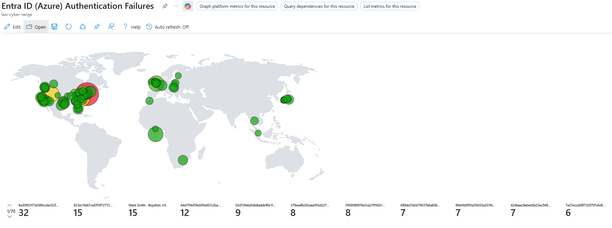
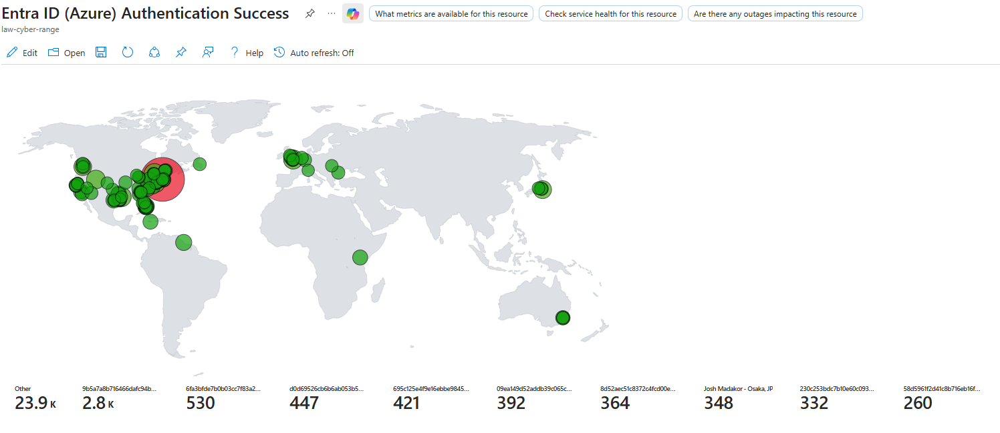
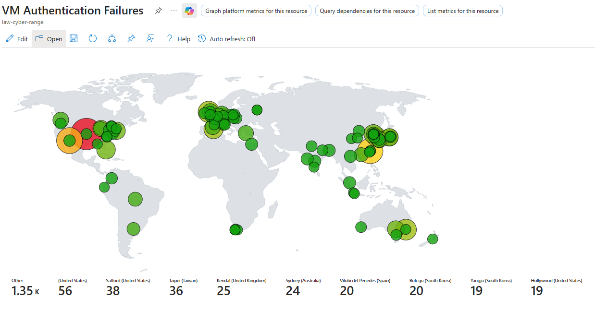
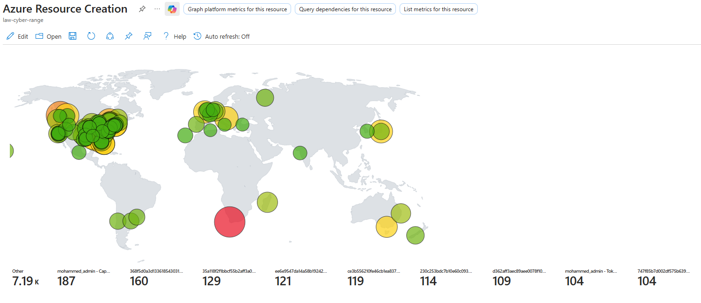
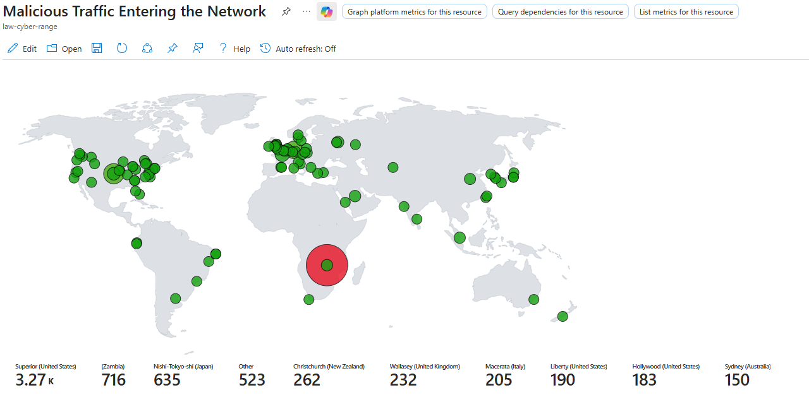

# Azure SOC KQL Workbook Maps

This project demonstrates hands-on experience building **SOC-relevant detections and visualizations** using KQL in Azure Monitor / Log Analytics.

The goal is to simulate real-world SOC workflows by identifying suspicious activity across:
- Identity (Entra ID)
- Endpoint (VM authentication)
- Network (malicious traffic)
- Cloud (Azure resource activity)

---

## 🔧 Skills Demonstrated

- KQL Query Development
- SIEM Log Analysis (Azure Monitor / Log Analytics)
- Identity Threat Detection (Entra ID Sign-in Logs)
- Network Threat Detection (Azure Network Analytics)
- Endpoint Monitoring (DeviceLogonEvents)
- Cloud Activity Monitoring (AzureActivity)
- GeoIP Enrichment & Threat Visualization
- Security Investigation & Detection Mindset

---

## 🧠 Data Sources Used

- `SigninLogs` (Entra ID Authentication)
- `AzureActivity` (Cloud Resource Activity)
- `DeviceLogonEvents` (VM Authentication)
- `AzureNetworkAnalytics_CL` (Network Traffic)
- GeoIP Watchlist (`_GetWatchlist("geoip")`)

---

# 📍 Detection Maps

---

## 1. Entra ID Authentication Failures

**Purpose:** Identify failed login attempts across users and geographic locations.

**What It Detects:**
- Password spraying
- Brute-force attempts
- Suspicious foreign login attempts

**How It Works:**
- Filters `SigninLogs` where `ResultType != 0`
- Aggregates failed login attempts by user and location
- Visualizes activity using geolocation mapping

**SOC Value:**
Highlights accounts under attack and suspicious login origins.

---

## 2. Entra ID Authentication Success

**Purpose:** Track successful logins to identify suspicious access.

**What It Detects:**
- Impossible travel scenarios
- Compromised accounts after failed login attempts
- High-volume successful logins

**How It Works:**
- Filters `SigninLogs` where `ResultType == 0`
- Aggregates login activity by identity and location

**SOC Value:**
Used to validate whether attackers successfully gained access.

---

## 3. VM Authentication Failures

**Purpose:** Monitor failed login attempts to virtual machines.

**What It Detects:**
- RDP brute-force attacks
- SSH brute-force attempts
- Repeated authentication failures from external IPs

**How It Works:**
- Queries `DeviceLogonEvents` for failed logons
- Enriches IP addresses with GeoIP data
- Aggregates attempts by source IP and location

**SOC Value:**
Identifies exposed systems and attack sources targeting VMs.

---

## 4. Azure Resource Creation

**Purpose:** Track creation of Azure resources across users and locations.

**What It Detects:**
- Unauthorized resource creation
- Suspicious cloud activity
- Potential persistence or crypto-mining setups

**How It Works:**
- Filters `AzureActivity` for successful `WRITE` operations
- Excludes service principals (GUID-based callers)
- Maps activity by caller and geolocation

**SOC Value:**
Helps identify suspicious or unauthorized changes in cloud environments.

---

## 5. Malicious Traffic Entering the Network

**Purpose:** Visualize inbound malicious network traffic.

**What It Detects:**
- Known malicious traffic flows
- Targeted destination ports
- Suspicious source IP locations

**How It Works:**
- Filters `AzureNetworkAnalytics_CL` for `MaliciousFlow`
- Extracts source/destination IP, port, and protocol
- Enriches with GeoIP data and maps attack sources

**SOC Value:**
Provides visibility into external threats targeting the environment.

---

# 🔍 Analyst Perspective

These detections are designed to answer key SOC questions:

- Are accounts being targeted or compromised?
- Are attackers attempting to access systems?
- Is malicious traffic reaching the network?
- Are unauthorized changes happening in the cloud?
- Did suspicious activity lead to successful access?

---

# 🚀 Project Outcome

This project demonstrates the ability to:
- Analyze real security logs
- Build detection logic using KQL
- Visualize threats for rapid investigation
- Think like a SOC Analyst in a cloud environment

---

# 📌 Author

**Aaron Welsh**  
- LinkedIn: https://www.linkedin.com/in/aaronswelsh/  
- GitHub: https://github.com/AaronW-Cipher  

---
